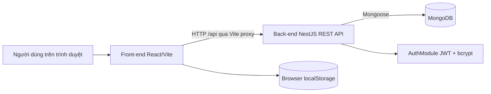
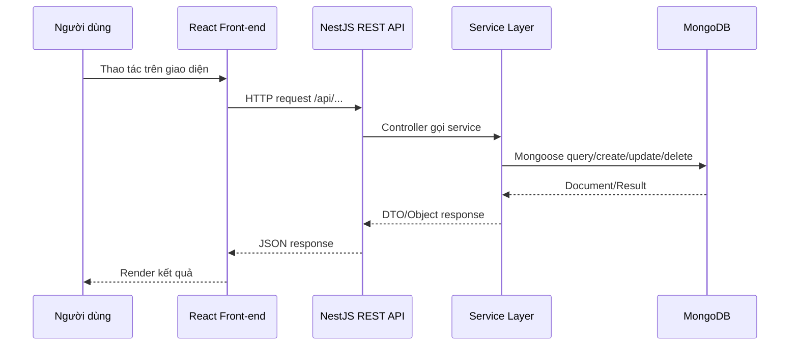
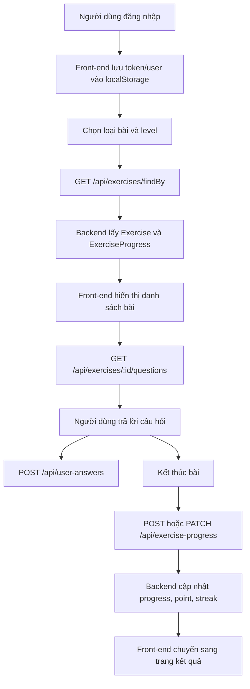
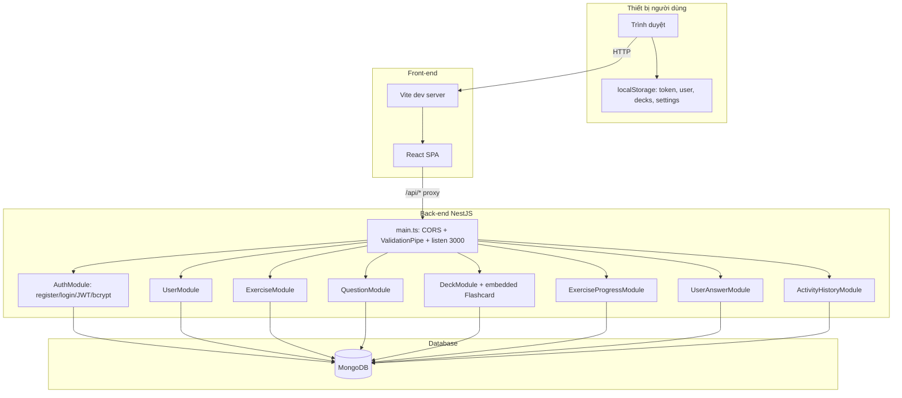

# Báo cáo kỹ thuật project GR1

## Phạm vi phân tích

Báo cáo này được lập dựa trên việc đọc source code trong project `GR1`, gồm hai module chính:

- Front-end: `FE`, sử dụng React, Vite, TypeScript, React Router, Tailwind CSS và các thư viện UI. Nguồn: `FE/package.json`, `FE/vite.config.ts`, `FE/src`.
- Back-end: `BE/gr1_be`, sử dụng NestJS, TypeScript, MongoDB/Mongoose, JWT, Passport và bcrypt. Nguồn: `BE/gr1_be/package.json`, `BE/gr1_be/src`, `BE/gr1_be/envSample`.

Các thành phần được kiểm tra nhưng không tìm thấy trong source code: Dockerfile, docker-compose, Redis, MQTT, WebSocket, worker, scheduler, storage server/object storage, gateway riêng, pom.xml, build.gradle, requirements.txt.

## 1. Môi trường hoạt động

### 1.1 Thiết bị người dùng

Đây là ứng dụng web học JLPT, người dùng truy cập bằng trình duyệt trên PC, laptop.
Giao diện sử dụng CSS responsive qua Tailwind/class CSS trong các component và page.


### 1.2 Máy chủ và thành phần triển khai

| Thành phần | Trạng thái trong source | Vai trò | Nguồn |
| --- | --- | --- | --- |
| Front-end Server | Có | Chạy ứng dụng React/Vite, phục vụ giao diện web và proxy `/api` đến backend khi chạy dev | `FE/package.json`, `FE/vite.config.ts` |
| Back-end Server | Có | Chạy NestJS API, xử lý nghiệp vụ, xác thực, thao tác MongoDB | `BE/gr1_be/package.json`, `BE/gr1_be/src/main.ts`, `BE/gr1_be/src/app.module.ts` |
| Database Server | Có | MongoDB, kết nối qua `MONGODB_URI` | `BE/gr1_be/src/app.module.ts`, `BE/gr1_be/envSample` |
| Authentication Server | Có trong backend | Module `AuthModule` nằm trong NestJS backend, không phải server tách riêng | `BE/gr1_be/src/auth` |
| Redis | Không có | Không tìm thấy trong source code. | Không có |
| MQTT Server | Không có | Không tìm thấy trong source code. | Không có |
| Worker | Không có | Không tìm thấy trong source code. | Không có |
| Scheduler | Không có | Không tìm thấy trong source code. | Không có |
| Storage Server | Không có | Không tìm thấy object storage/file storage server; chỉ có `localStorage` ở browser | `FE/src/app/utils/storage.ts`, `FE/src/app/utils/deckStorage.ts` |
| Gateway | Không có | Không tìm thấy API gateway riêng | Không có |

### 1.3 Vai trò từng thành phần

Front-end:

- Hiển thị giao diện học JLPT, đăng nhập/đăng ký, danh sách bài luyện tập, phiên làm bài, kết quả, bộ flashcard, tiến độ, hồ sơ và cài đặt. Nguồn: `FE/src/app/routes.tsx`, `FE/src/app/pages`.
- Gửi request REST API đến backend qua đường dẫn `/api`. Nguồn: `FE/src/app/api/authApi.ts`, `FE/src/app/data/exercises.ts`, `FE/src/app/api/exProgress.ts`, `FE/src/app/utils/storage.ts`, `FE/src/app/utils/deckStorage.ts`.
- Lưu token và user vào `localStorage` sau đăng nhập. Nguồn: `FE/src/app/pages/Login.tsx`.
- Kiểm tra trạng thái đăng nhập ở client bằng `ProtectedRoute`, dựa trên token trong `localStorage`. Nguồn: `FE/src/app/components/ProtectedRoute.tsx`.

Back-end:

- Cung cấp REST API bằng NestJS. Nguồn: các controller trong `BE/gr1_be/src/*/*.controller.ts`.
- Kết nối MongoDB qua `MongooseModule.forRootAsync` và biến môi trường `MONGODB_URI`. Nguồn: `BE/gr1_be/src/app.module.ts`.
- Xác thực đăng ký/đăng nhập bằng email (`gmail`) và mật khẩu, hash password bằng bcrypt, phát JWT. Nguồn: `BE/gr1_be/src/auth/auth.service.ts`.
- Quản lý user, bài tập, câu hỏi, bộ flashcard, tiến độ làm bài, lịch sử hoạt động và câu trả lời người dùng. Nguồn: `BE/gr1_be/src/user`, `exercise`, `question`, `deck`, `exercise-progress`, `activity-history`, `user-answer`.

Database:

- MongoDB lưu các collection tương ứng với schema Mongoose: `User`, `Exercise`, `Question`, `Deck`, `Flashcard` lồng trong `Deck`, `ExerciseProgress`, `ActivityHistory`, `UserAnswer`. Nguồn: các file `*.entity.ts` trong `BE/gr1_be/src`.

Realtime/MQTT/WebSocket:

- Không tìm thấy trong source code.

Worker/Background Job:

- Không tìm thấy trong source code.

Cache:

- Không tìm thấy Redis hoặc cache server trong source code.
- Front-end có dùng `localStorage` cho token, user, custom decks, saved cards và settings. Nguồn: `FE/src/app/pages/Login.tsx`, `FE/src/app/utils/storage.ts`, `FE/src/app/utils/deckStorage.ts`, `FE/src/app/pages/Settings.tsx`.

### 1.4 Hệ điều hành hỗ trợ

Suy luận từ kiến trúc project: project dùng Node.js/NPM cho cả front-end và back-end, nên có thể chạy trên Windows, Linux hoặc macOS nếu cài Node.js và truy cập được MongoDB.

Căn cứ từ source:

- Front-end dùng Vite script `dev` và `build`. Nguồn: `FE/package.json`.
- Back-end dùng NestJS script `start:dev`, `build`, `start:prod`. Nguồn: `BE/gr1_be/package.json`.
- Back-end TypeScript target `ES2023`, module `nodenext`. Nguồn: `BE/gr1_be/tsconfig.json`.

Docker: Không tìm thấy Dockerfile hoặc docker-compose trong source code. Vì vậy không có căn cứ để khẳng định project đã được container hóa.

### 1.5 Sơ đồ tích hợp hệ thống



Luồng dữ liệu:

1. Người dùng thao tác trên giao diện React.
2. Front-end gửi request HTTP đến `/api/...`.
3. Vite dev server proxy `/api` sang `http://localhost:3000` và bỏ prefix `/api`. Nguồn: `FE/vite.config.ts`.
4. Back-end NestJS nhận request qua controller, gọi service xử lý nghiệp vụ.
5. Service dùng Mongoose model để đọc/ghi MongoDB.
6. Backend trả JSON response cho front-end.
7. Front-end cập nhật UI và lưu một số dữ liệu cục bộ vào `localStorage`.

## 2. Hướng dẫn cài đặt và chạy thử

### 2.1 Yêu cầu môi trường

Yêu cầu xác định từ source code:

- Node.js/NPM: cần cho cả `FE` và `BE/gr1_be`, vì cả hai đều có `package.json`.
- Front-end dependencies chính: React, Vite, TypeScript, Tailwind CSS, React Router, Radix UI, MUI, lucide-react, recharts. Nguồn: `FE/package.json`.
- Back-end dependencies chính: NestJS, Mongoose, `@nestjs/config`, `@nestjs/jwt`, Passport JWT, bcrypt, class-validator. Nguồn: `BE/gr1_be/package.json`.
- MongoDB: backend dùng `@nestjs/mongoose`, `mongoose` và biến `MONGODB_URI`. Nguồn: `BE/gr1_be/src/app.module.ts`, `BE/gr1_be/envSample`.
- Java/Maven/Gradle/Python requirements: Không tìm thấy trong source code.
- Docker: Không tìm thấy trong source code.
- Redis/MQTT: Không tìm thấy trong source code.

### 2.2 Cấu hình môi trường

Back-end cần biến môi trường:

- `MONGODB_URI`: chuỗi kết nối MongoDB. Nguồn: `BE/gr1_be/envSample`.
- `JWT_SECRET`: secret dùng để ký JWT trong `AuthModule`. Nguồn: `BE/gr1_be/envSample`, `BE/gr1_be/src/auth/auth.module.ts`.
- `PORT`: tùy chọn; nếu không có thì backend lắng nghe port `3000`. Nguồn: `BE/gr1_be/src/main.ts`.

Lưu ý bảo mật: file `BE/gr1_be/envSample` có chứa giá trị mẫu cho connection string và JWT secret. Khi triển khai thật nên tạo file `.env` riêng và không commit secret thật.

### 2.3 Các bước cài đặt và chạy

Tại thư mục root project:

```powershell
cd "D:\vinh code\react-app\GR1"
```

Cài đặt và chạy back-end:

```powershell
cd BE\gr1_be
npm install
```

Tạo file `.env` trong `BE/gr1_be` dựa trên `envSample`:

```text
MONGODB_URI=<MongoDB connection string>
JWT_SECRET=<JWT secret>
```

Chạy back-end ở chế độ dev:

```powershell
npm run start:dev
```

Backend mặc định chạy ở:

```text
http://localhost:3000
```

Cài đặt và chạy front-end:

```powershell
cd ..\..\FE
npm install
npm run dev
```

Front-end Vite mặc định chạy ở:

```text
http://localhost:5173
```

Kết nối front-end/back-end:

- Front-end gọi API bằng prefix `/api`.
- `FE/vite.config.ts` proxy `/api` đến `http://localhost:3000`.
- Backend bật CORS cho origin `http://localhost:5173`. Nguồn: `BE/gr1_be/src/main.ts`.

### 2.4 Chạy thử self test

Kịch bản kiểm thử đơn giản theo đúng source code:

1. Mở `http://localhost:5173/login`.
2. Chọn đăng ký, nhập họ tên, email và mật khẩu.
3. Front-end gọi `POST /api/auth/register`; Vite proxy thành `POST http://localhost:3000/auth/register`. Nguồn: `FE/src/app/api/authApi.ts`, `BE/gr1_be/src/auth/auth.controller.ts`.
4. Backend hash password bằng bcrypt và tạo user trong MongoDB. Nguồn: `BE/gr1_be/src/auth/auth.service.ts`, `BE/gr1_be/src/user/user.entity.ts`.
5. Đăng nhập bằng email/mật khẩu.
6. Front-end gọi `POST /api/auth/login`, nhận `access_token` và `user`, sau đó lưu vào `localStorage`. Nguồn: `FE/src/app/pages/Login.tsx`.
7. Truy cập trang chủ `/`; `ProtectedRoute` kiểm tra token trong `localStorage`. Nguồn: `FE/src/app/components/ProtectedRoute.tsx`.
8. Chọn dạng luyện tập, ví dụ từ vựng/ngữ pháp/nghe/đọc. Front-end gọi `GET /api/exercises/findBy?userId=...&type=...&level=...`. Nguồn: `FE/src/app/data/exercises.ts`, `BE/gr1_be/src/exercise/exercise.controller.ts`.
9. Vào phiên làm bài, front-end lấy câu hỏi qua `GET /api/exercises/:id/questions`. Nguồn: `FE/src/app/pages/PracticeSession.tsx`, `BE/gr1_be/src/exercise/exercise.service.ts`.
10. Chọn đáp án, front-end lưu từng câu trả lời qua `POST /api/user-answers`. Nguồn: `FE/src/app/utils/storage.ts`, `BE/gr1_be/src/user-answer`.
11. Kết thúc bài, front-end tạo hoặc cập nhật tiến độ qua `POST /api/exercise-progress` hoặc `PATCH /api/exercise-progress/:id`. Backend lưu tiến độ và cập nhật điểm/streak của user. Nguồn: `FE/src/app/pages/PracticeSession.tsx`, `BE/gr1_be/src/exercise-progress/exercise-progress.service.ts`.
12. Kiểm tra dữ liệu trong MongoDB ở các collection tương ứng: user, user answers, exercise progress.

Kịch bản IoT/MQTT: Không tìm thấy trong source code.

## 3. Nguyên lý cơ bản

### 3.1 Kiến trúc tổng thể

Suy luận từ kiến trúc project: hệ thống là web app client-server dạng SPA + REST API + MongoDB.



### 3.2 Luồng request-response

1. Người dùng thao tác ở front-end.
2. React component/page gọi helper API hoặc utility.
3. Request đi đến `/api/...`.
4. Vite proxy route `/api` sang backend port `3000`. Nguồn: `FE/vite.config.ts`.
5. NestJS controller nhận request.
6. Controller gọi service.
7. Service thao tác database bằng Mongoose model.
8. Kết quả trả về JSON.
9. Front-end cập nhật state/UI.

### 3.3 Authentication

Backend có module xác thực:

- `AuthController` cung cấp `POST /auth/register` và `POST /auth/login`. Nguồn: `BE/gr1_be/src/auth/auth.controller.ts`.
- `AuthService.register` kiểm tra email đã tồn tại, hash password bằng bcrypt, tạo user và trả về `id`, `userName`, `gmail`. Nguồn: `BE/gr1_be/src/auth/auth.service.ts`.
- `AuthService.login` tìm user theo `gmail`, so sánh password bằng bcrypt, ký JWT và trả về `access_token` kèm thông tin user. Nguồn: `BE/gr1_be/src/auth/auth.service.ts`.
- `AuthModule` cấu hình `JwtModule.registerAsync` với `JWT_SECRET`, token hết hạn `1d`. Nguồn: `BE/gr1_be/src/auth/auth.module.ts`.
- Front-end lưu token vào `localStorage` sau login. Nguồn: `FE/src/app/pages/Login.tsx`.

Ghi nhận kỹ thuật từ source: `JwtStrategy` đang dùng `secretOrKey: 'JWT_SECRET_KEY'` dạng chuỗi hard-code, trong khi `AuthModule` ký token bằng biến môi trường `JWT_SECRET`. Nguồn: `BE/gr1_be/src/auth/jwt.strategy.ts`, `BE/gr1_be/src/auth/auth.module.ts`. Nếu áp dụng guard JWT thật sự, cấu hình này có nguy cơ làm xác thực bearer token không khớp secret.

### 3.4 Authorization

Không tìm thấy phân quyền role/permission trong source code.

Không tìm thấy controller nào đang dùng `@UseGuards(JwtAuthGuard)` trong source code. Có class `JwtAuthGuard` nhưng chưa thấy được áp dụng cho endpoint. Nguồn: `BE/gr1_be/src/auth/jwt-auth.guard.ts`, kết quả đọc các controller trong `BE/gr1_be/src`.

Front-end có bảo vệ route ở client bằng `ProtectedRoute`, nhưng logic chỉ kiểm tra token tồn tại trong `localStorage`, không xác minh token với backend. Nguồn: `FE/src/app/components/ProtectedRoute.tsx`.

### 3.5 Database và model dữ liệu

Back-end dùng MongoDB qua Mongoose:

- `AppModule` gọi `MongooseModule.forRootAsync` với `MONGODB_URI`. Nguồn: `BE/gr1_be/src/app.module.ts`.
- Mỗi module domain đăng ký schema bằng `MongooseModule.forFeature`. Nguồn: các file `*.module.ts` trong `BE/gr1_be/src`.

Các schema chính:

| Schema | Trường chính | Nguồn |
| --- | --- | --- |
| User | `userName`, `gmail`, `password`, `createdTime`, `totalQuestion`, `rightAnswer`, `point`, `streak`, `lastStudyDate` | `BE/gr1_be/src/user/user.entity.ts` |
| Exercise | `title`, `questionIDs`, `description`, `type`, `level`, `questionCount`, `timeLimit`, `difficulty`, `score` | `BE/gr1_be/src/exercise/exercise.entity.ts` |
| Question | `type`, `level`, `audioURL`, `imageURL`, `readingContent`, `question`, `options`, `correctAnswer`, `explanation` | `BE/gr1_be/src/question/question.entity.ts` |
| Deck | `name`, `description`, `cards`, `createdAt`, `color`, `icon`, `visibility`, `viewCount` | `BE/gr1_be/src/deck/deck.entity.ts` |
| Flashcard | `front`, `back`, `type`, `level`, `example`, `image`, `audio`, `status` | `BE/gr1_be/src/flashcard/flashcard.entity.ts` |
| ExerciseProgress | `userId`, `exerciseId`, `exerciseTitle`, `completeAt`, `score`, `totalQuestion`, `rightAnswer` | `BE/gr1_be/src/exercise-progress/exercise-progress.entity.ts` |
| UserAnswer | `userId`, `questionId`, `type`, `level`, `isCorrect`, `timeSpent`, `answeredAt` | `BE/gr1_be/src/user-answer/user-answer.entity.ts` |
| ActivityHistory | `accountId`, `title`, `completeAt`, `totalQuestion`, `rightAnswer` | `BE/gr1_be/src/activity-history/activity-history.entity.ts` |

### 3.6 Module nghiệp vụ

Auth module:

- Đăng ký và đăng nhập.
- Hash password bằng bcrypt.
- Sinh JWT cho user.
- Nguồn: `BE/gr1_be/src/auth`.

User module:

- CRUD user qua `POST /users`, `GET /users`, `GET /users/:id`, `PATCH /users/:id`, `DELETE /users/:id`.
- Nguồn: `BE/gr1_be/src/user`.

Exercise module:

- CRUD bài tập qua `/exercises`.
- Lọc bài tập theo `userId`, `level`, `type` qua `GET /exercises/findBy`.
- Lấy bài tập theo user và id qua `GET /exercises/ByUserIandId`.
- Lấy danh sách câu hỏi thuộc bài tập qua `GET /exercises/:id/questions`.
- Khi có `userId`, service bổ sung trạng thái `completed`, `score`, `progressId` dựa trên `ExerciseProgress`.
- Nguồn: `BE/gr1_be/src/exercise`.

Question module:

- CRUD câu hỏi qua `/questions`.
- Câu hỏi hỗ trợ loại vocabulary, grammar, listening, reading; level N5-N1; có thể có audio/image/reading content.
- Nguồn: `BE/gr1_be/src/question`.

Deck/Flashcard module:

- CRUD deck qua `/decks`.
- Nhân bản deck qua `POST /decks/:id/duplicate`.
- Deck chứa mảng `cards` là flashcard embedded schema.
- Nguồn: `BE/gr1_be/src/deck`, `BE/gr1_be/src/flashcard`.

ExerciseProgress module:

- Tạo/cập nhật/xóa/lấy tiến độ bài làm.
- Lấy tiến độ theo user qua `GET /exercise-progress/user/:userId`.
- Khi tạo/cập nhật progress, service cập nhật điểm và streak của user.
- Nguồn: `BE/gr1_be/src/exercise-progress`.

UserAnswer module:

- Lưu từng câu trả lời của user.
- Lấy toàn bộ hoặc lấy theo user.
- Nguồn: `BE/gr1_be/src/user-answer`.

ActivityHistory module:

- CRUD lịch sử hoạt động.
- Không thấy front-end hiện tại gọi trực tiếp API này trong các file đã đọc.
- Nguồn: `BE/gr1_be/src/activity-history`; phần gọi front-end không tìm thấy trong `FE/src/app`.

### 3.7 Luồng làm bài luyện tập



Nguồn luồng front-end: `FE/src/app/pages/PracticeList.tsx`, `FE/src/app/pages/PracticeSession.tsx`, `FE/src/app/pages/PracticeResult.tsx`, `FE/src/app/data/exercises.ts`, `FE/src/app/api/exProgress.ts`, `FE/src/app/utils/storage.ts`.

Nguồn luồng back-end: `BE/gr1_be/src/exercise`, `BE/gr1_be/src/question`, `BE/gr1_be/src/user-answer`, `BE/gr1_be/src/exercise-progress`.

### 3.8 MQTT/WebSocket/Realtime/Cache/Storage/Worker

MQTT: Không tìm thấy trong source code.

WebSocket: Không tìm thấy trong source code.

Realtime push: Không tìm thấy trong source code.

Redis/cache server: Không tìm thấy trong source code.

Storage server/object storage: Không tìm thấy trong source code.

Worker/background job/scheduler: Không tìm thấy trong source code.

Browser local storage:

- Token và user: `FE/src/app/pages/Login.tsx`, `FE/src/app/components/ProtectedRoute.tsx`, `FE/src/app/components/Layout.tsx`.
- Custom deck/saved cards/settings: `FE/src/app/utils/storage.ts`, `FE/src/app/utils/deckStorage.ts`, `FE/src/app/pages/Settings.tsx`.

## 4. Tích hợp hệ thống

### 4.1 Thành phần phần cứng

| Thành phần | Vai trò | Dữ liệu nhận | Dữ liệu gửi | Nguồn/căn cứ |
| --- | --- | --- | --- | --- |
| Máy người dùng | Chạy trình duyệt và thao tác học JLPT | HTML/CSS/JS, JSON API response | HTTP request, form login, đáp án, thao tác deck | Suy luận từ kiến trúc project; `FE/src` |
| Front-end server/dev server | Phục vụ React app, proxy API trong môi trường dev | Request từ trình duyệt | Static assets, proxy request `/api` sang backend | `FE/vite.config.ts`, `FE/package.json` |
| Back-end server | Chạy NestJS API | HTTP request từ front-end | JSON response, truy vấn MongoDB | `BE/gr1_be/src/main.ts`, `BE/gr1_be/src/app.module.ts` |
| Database server | Lưu dữ liệu ứng dụng | Query/create/update/delete từ backend | Document/result MongoDB | `BE/gr1_be/src/app.module.ts`, các `*.entity.ts` |
| MQTT Broker | Không có | Không tìm thấy trong source code. | Không tìm thấy trong source code. | Không có |
| Thiết bị IoT | Không có | Không tìm thấy trong source code. | Không tìm thấy trong source code. | Không có |
| Cảm biến | Không có | Không tìm thấy trong source code. | Không tìm thấy trong source code. | Không có |
| Gateway | Không có gateway riêng | Không tìm thấy trong source code. | Không tìm thấy trong source code. | Không có |

### 4.2 Thành phần phần mềm

| Thành phần | Chạy trên phần cứng nào | Chức năng | Giao tiếp với | Giao thức | Nguồn |
| --- | --- | --- | --- | --- | --- |
| React/Vite Front-end | Máy người dùng + front-end dev server | Giao diện học JLPT, routing, gọi API, lưu localStorage | Backend REST API, localStorage | HTTP, browser storage | `FE/src`, `FE/vite.config.ts` |
| NestJS Back-end | Back-end server | REST API, business logic, validation, CORS | Front-end, MongoDB | HTTP, MongoDB protocol qua Mongoose | `BE/gr1_be/src/main.ts`, `BE/gr1_be/src/app.module.ts` |
| REST API | Back-end server | Endpoint cho auth/user/exercise/question/deck/progress/history/answers | Front-end | HTTP/JSON | Các controller trong `BE/gr1_be/src` |
| MongoDB/Mongoose | Database server | Lưu user, bài tập, câu hỏi, deck, progress, answers | Backend service | MongoDB connection string | `BE/gr1_be/src/app.module.ts`, `BE/gr1_be/src/*/*.entity.ts` |
| Authentication | Back-end server + front-end route guard | Đăng ký, đăng nhập, hash password, JWT, client route protection | User collection, localStorage | HTTP/JSON, JWT bearer concept | `BE/gr1_be/src/auth`, `FE/src/app/pages/Login.tsx`, `FE/src/app/components/ProtectedRoute.tsx` |
| Middleware/Pipe | Back-end server | Global `ValidationPipe` whitelist/transform/forbidNonWhitelisted | Request body DTO | NestJS pipeline | `BE/gr1_be/src/main.ts` |
| Worker | Không có | Không tìm thấy trong source code. | Không tìm thấy trong source code. | Không tìm thấy trong source code. | Không có |
| Scheduler | Không có | Không tìm thấy trong source code. | Không tìm thấy trong source code. | Không tìm thấy trong source code. | Không có |
| MQTT Service | Không có | Không tìm thấy trong source code. | Không tìm thấy trong source code. | Không tìm thấy trong source code. | Không có |
| Redis | Không có | Không tìm thấy trong source code. | Không tìm thấy trong source code. | Không tìm thấy trong source code. | Không có |
| Storage | Browser localStorage | Lưu token, user, custom decks, saved cards, settings | Front-end | Browser localStorage API | `FE/src/app/pages/Login.tsx`, `FE/src/app/utils/storage.ts`, `FE/src/app/utils/deckStorage.ts` |

### 4.3 Sơ đồ tích hợp đầy đủ



## 5. Bảng API chính

| Nhóm | Endpoint | Chức năng | Nguồn |
| --- | --- | --- | --- |
| Root | `GET /` | Trả `Hello World!` | `BE/gr1_be/src/app.controller.ts`, `BE/gr1_be/src/app.service.ts` |
| Auth | `POST /auth/register` | Đăng ký user | `BE/gr1_be/src/auth/auth.controller.ts` |
| Auth | `POST /auth/login` | Đăng nhập, trả JWT và user | `BE/gr1_be/src/auth/auth.controller.ts`, `BE/gr1_be/src/auth/auth.service.ts` |
| Users | `POST /users` | Tạo user | `BE/gr1_be/src/user/user.controller.ts` |
| Users | `GET /users` | Lấy danh sách user | `BE/gr1_be/src/user/user.controller.ts` |
| Users | `GET /users/:id` | Lấy user theo id | `BE/gr1_be/src/user/user.controller.ts` |
| Users | `PATCH /users/:id` | Cập nhật user | `BE/gr1_be/src/user/user.controller.ts` |
| Users | `DELETE /users/:id` | Xóa user | `BE/gr1_be/src/user/user.controller.ts` |
| Exercises | `POST /exercises` | Tạo bài tập | `BE/gr1_be/src/exercise/exercise.controller.ts` |
| Exercises | `GET /exercises` | Lấy toàn bộ bài tập | `BE/gr1_be/src/exercise/exercise.controller.ts` |
| Exercises | `GET /exercises/findBy` | Lọc theo `userId`, `level`, `type` | `BE/gr1_be/src/exercise/exercise.controller.ts` |
| Exercises | `GET /exercises/ByUserIandId` | Lấy bài tập theo user và id, kèm trạng thái progress | `BE/gr1_be/src/exercise/exercise.controller.ts` |
| Exercises | `GET /exercises/:id/questions` | Lấy câu hỏi của bài tập | `BE/gr1_be/src/exercise/exercise.controller.ts` |
| Exercises | `GET /exercises/:id` | Lấy bài tập theo id | `BE/gr1_be/src/exercise/exercise.controller.ts` |
| Exercises | `PATCH /exercises/:id` | Cập nhật bài tập | `BE/gr1_be/src/exercise/exercise.controller.ts` |
| Exercises | `DELETE /exercises/:id` | Xóa bài tập | `BE/gr1_be/src/exercise/exercise.controller.ts` |
| Questions | `POST /questions` | Tạo câu hỏi | `BE/gr1_be/src/question/question.controller.ts` |
| Questions | `GET /questions` | Lấy toàn bộ câu hỏi | `BE/gr1_be/src/question/question.controller.ts` |
| Questions | `GET /questions/:id` | Lấy câu hỏi theo id | `BE/gr1_be/src/question/question.controller.ts` |
| Questions | `PATCH /questions/:id` | Cập nhật câu hỏi | `BE/gr1_be/src/question/question.controller.ts` |
| Questions | `DELETE /questions/:id` | Xóa câu hỏi | `BE/gr1_be/src/question/question.controller.ts` |
| Decks | `POST /decks` | Tạo deck | `BE/gr1_be/src/deck/deck.controller.ts` |
| Decks | `POST /decks/:id/duplicate` | Nhân bản deck | `BE/gr1_be/src/deck/deck.controller.ts` |
| Decks | `GET /decks` | Lấy toàn bộ deck | `BE/gr1_be/src/deck/deck.controller.ts` |
| Decks | `GET /decks/:id` | Lấy deck theo id | `BE/gr1_be/src/deck/deck.controller.ts` |
| Decks | `PATCH /decks/:id` | Cập nhật deck | `BE/gr1_be/src/deck/deck.controller.ts` |
| Decks | `DELETE /decks/:id` | Xóa deck | `BE/gr1_be/src/deck/deck.controller.ts` |
| Exercise progress | `POST /exercise-progress` | Tạo progress | `BE/gr1_be/src/exercise-progress/exercise-progress.controller.ts` |
| Exercise progress | `GET /exercise-progress/user/:userId` | Lấy progress theo user | `BE/gr1_be/src/exercise-progress/exercise-progress.controller.ts` |
| Exercise progress | `GET /exercise-progress` | Lấy toàn bộ progress | `BE/gr1_be/src/exercise-progress/exercise-progress.controller.ts` |
| Exercise progress | `GET /exercise-progress/:id` | Lấy progress theo id | `BE/gr1_be/src/exercise-progress/exercise-progress.controller.ts` |
| Exercise progress | `PATCH /exercise-progress/:id` | Cập nhật progress | `BE/gr1_be/src/exercise-progress/exercise-progress.controller.ts` |
| Exercise progress | `DELETE /exercise-progress/:id` | Xóa progress | `BE/gr1_be/src/exercise-progress/exercise-progress.controller.ts` |
| User answers | `POST /user-answers` | Lưu câu trả lời | `BE/gr1_be/src/user-answer/user-answer.controller.ts` |
| User answers | `GET /user-answers` | Lấy toàn bộ câu trả lời | `BE/gr1_be/src/user-answer/user-answer.controller.ts` |
| User answers | `GET /user-answers/user/:userId` | Lấy câu trả lời theo user | `BE/gr1_be/src/user-answer/user-answer.controller.ts` |
| User answers | `GET /user-answers/:id` | Lấy câu trả lời theo id | `BE/gr1_be/src/user-answer/user-answer.controller.ts` |
| User answers | `DELETE /user-answers/:id` | Xóa câu trả lời | `BE/gr1_be/src/user-answer/user-answer.controller.ts` |
| Activity history | `POST /activity-history` | Tạo lịch sử hoạt động | `BE/gr1_be/src/activity-history/activity-history.controller.ts` |
| Activity history | `GET /activity-history` | Lấy toàn bộ lịch sử | `BE/gr1_be/src/activity-history/activity-history.controller.ts` |
| Activity history | `GET /activity-history/:id` | Lấy lịch sử theo id | `BE/gr1_be/src/activity-history/activity-history.controller.ts` |
| Activity history | `PATCH /activity-history/:id` | Cập nhật lịch sử | `BE/gr1_be/src/activity-history/activity-history.controller.ts` |
| Activity history | `DELETE /activity-history/:id` | Xóa lịch sử | `BE/gr1_be/src/activity-history/activity-history.controller.ts` |

## 6. Kiểm tra tính đầy đủ

| Thành phần | Đã tìm thấy trong source | File hoặc thư mục chứa |
| --- | --- | --- |
| Frontend | Có | `FE`, `FE/src`, `FE/package.json`, `FE/vite.config.ts` |
| Backend | Có | `BE/gr1_be`, `BE/gr1_be/src`, `BE/gr1_be/package.json` |
| MongoDB | Có | `BE/gr1_be/src/app.module.ts`, `BE/gr1_be/envSample`, `BE/gr1_be/src/*/*.entity.ts` |
| MQTT | Không có | Không tìm thấy trong source code. |
| Redis | Không có | Không tìm thấy trong source code. |
| Docker | Không có | Không tìm thấy Dockerfile hoặc docker-compose trong source code. |
| Worker | Không có | Không tìm thấy trong source code. |
| Scheduler | Không có | Không tìm thấy trong source code. |
| Authentication | Có | `BE/gr1_be/src/auth`, `FE/src/app/pages/Login.tsx`, `FE/src/app/components/ProtectedRoute.tsx` |
| Authorization | Không có | Không tìm thấy role/permission hoặc `@UseGuards` áp dụng trên controller. |
| REST API | Có | Các file `*.controller.ts` trong `BE/gr1_be/src` |
| WebSocket | Không có | Không tìm thấy trong source code. |
| IoT | Không có | Không tìm thấy trong source code. |
| Database schema | Có | Các file `*.entity.ts` trong `BE/gr1_be/src` |
| Middleware/Pipe | Có | `BE/gr1_be/src/main.ts` dùng global `ValidationPipe` |
| Storage server | Không có | Không tìm thấy trong source code. |
| Browser localStorage | Có | `FE/src/app/pages/Login.tsx`, `FE/src/app/utils/storage.ts`, `FE/src/app/utils/deckStorage.ts`, `FE/src/app/pages/Settings.tsx` |
| API Gateway | Không có | Không tìm thấy trong source code. |
| Front-end routing | Có | `FE/src/app/routes.tsx` |
| Test | Có mức cơ bản | `BE/gr1_be/src/app.controller.spec.ts`, `BE/gr1_be/test/app.e2e-spec.ts`, `BE/gr1_be/test/jest-e2e.json` |
| README | Có nhưng rất ít nội dung | `README.md`, `FE/README.md`, `BE/gr1_be/README.md` |

## 7. Nhận xét kỹ thuật quan trọng từ source

- Source hiện tại là mô hình monorepo đơn giản gồm `FE` và `BE/gr1_be`, chưa có cấu hình triển khai production như Docker, reverse proxy, CI/CD hoặc file environment chuẩn `.env.example`.
- Backend có `JwtAuthGuard` và `JwtStrategy`, nhưng chưa thấy endpoint áp dụng guard. Do đó API hiện tại về mặt source đang gần như public, ngoại trừ logic đăng nhập/đăng ký.
- `JwtStrategy` dùng hard-code `secretOrKey: 'JWT_SECRET_KEY'` trong khi `AuthModule` ký token bằng `JWT_SECRET`. Đây là điểm cần rà soát nếu muốn bật xác thực JWT server-side.
- Front-end bảo vệ route bằng kiểm tra token tồn tại trong `localStorage`, chưa gọi backend để verify token.
- File `envSample` chứa thông tin cấu hình nhạy cảm dạng rõ; khi làm đồ án/triển khai nên thay bằng giá trị mẫu và giữ secret thật ngoài Git.
- Một số chức năng deck ở front-end vừa gọi API vừa lưu vào `localStorage` cho các thao tác card/import/export. Nguồn: `FE/src/app/utils/deckStorage.ts`. Cần thống nhất chiến lược lưu trữ nếu muốn dữ liệu đồng bộ hoàn toàn qua backend.

