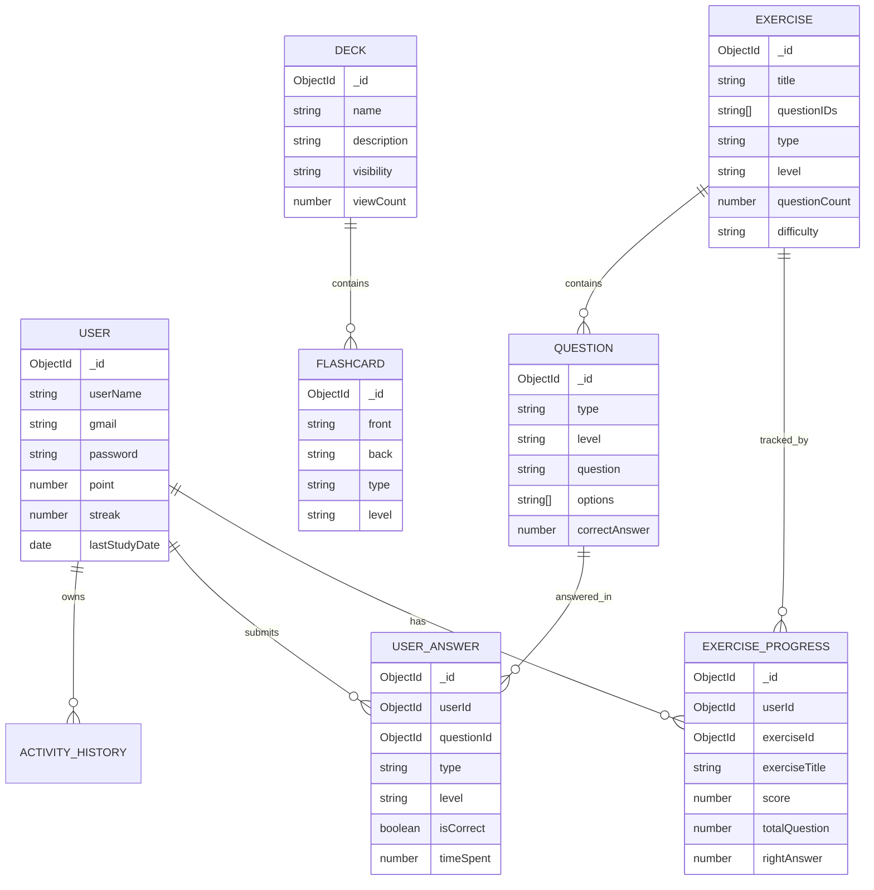

# Báo cáo: Thuật toán cơ bản, thiết kế cơ sở dữ liệu và cấu hình

## 1. Các thuật toán cơ bản

### 1.1 Tạo token bằng JWT

Project sử dụng JWT cho chức năng đăng nhập. Khi người dùng gửi `gmail` và `password`, backend kiểm tra tài khoản, sau đó tạo payload:

```ts
const payload = {
  sub: user._id,
  gmail: user.gmail,
};
```

Token được tạo bằng:

```ts
this.jwtService.sign(payload)
```

Nguồn: `BE/gr1_be/src/auth/auth.service.ts`.

JWT được cấu hình trong `AuthModule`, dùng biến môi trường `JWT_SECRET` và thời hạn token là `1d`.

Nguồn: `BE/gr1_be/src/auth/auth.module.ts`.

Ý nghĩa:

- `sub`: lưu id của người dùng.
- `gmail`: lưu email đăng nhập của người dùng.
- `JWT_SECRET`: khóa bí mật dùng để ký token.
- `expiresIn: '1d'`: token hết hạn sau 1 ngày.

### 1.2 Băm mật khẩu

Project không dùng MD5.

Không tìm thấy trong source code công thức dạng:

```text
MD5(key + "myapp" + key)
```

Thay vào đó, project dùng `bcrypt` để băm mật khẩu khi đăng ký:

```ts
const hashedPassword = await bcrypt.hash(password, 10);
```

Khi đăng nhập, mật khẩu được kiểm tra bằng:

```ts
const isMatch = await bcrypt.compare(password, user.password);
```

Nguồn: `BE/gr1_be/src/auth/auth.service.ts`.

Giải thích:

- `bcrypt.hash(password, 10)` băm mật khẩu với salt round là `10`.
- Mật khẩu gốc không được lưu trực tiếp vào database.
- Khi đăng nhập, hệ thống so sánh mật khẩu người dùng nhập với hash đã lưu.

### 1.3 Tạo id cho đối tượng

Project sử dụng MongoDB/Mongoose. Các document như `User`, `Exercise`, `Question`, `Deck`, `ExerciseProgress`, `UserAnswer` được MongoDB tạo `_id` tự động theo dạng `ObjectId`.

Ví dụ trong source, nhiều entity khai báo `_id` là `Types.ObjectId`:

```ts
_id!: Types.ObjectId;
```

Nguồn:

- `BE/gr1_be/src/user/user.entity.ts`
- `BE/gr1_be/src/exercise-progress/exercise-progress.entity.ts`
- `BE/gr1_be/src/flashcard/flashcard.entity.ts`

Khi cần truy vấn hoặc lưu khóa ngoại, backend chuyển string id sang `ObjectId`:

```ts
new Types.ObjectId(userId)
new Types.ObjectId(exerciseId)
```

Nguồn:

- `BE/gr1_be/src/exercise-progress/exercise-progress.service.ts`
- `BE/gr1_be/src/user-answer/user-answer.service.ts`
- `BE/gr1_be/src/exercise/exercise.service.ts`

Không tìm thấy trong source code cơ chế tạo GUID hoặc hàm random để tạo id chính cho database.

### 1.4 Kiểm tra dữ liệu đầu vào

Backend sử dụng `ValidationPipe` của NestJS để kiểm tra dữ liệu request trước khi đưa vào controller/service.

Nguồn: `BE/gr1_be/src/main.ts`.

Cấu hình hiện tại:

```ts
app.useGlobalPipes(
  new ValidationPipe({
    whitelist: true,
    transform: true,
    forbidNonWhitelisted: true,
  }),
);
```

Giải thích:

- `whitelist: true`: tự động loại bỏ field không được khai báo trong DTO.
- `transform: true`: chuyển đổi dữ liệu đầu vào theo kiểu DTO khi có thể.
- `forbidNonWhitelisted: true`: nếu request gửi field không hợp lệ, hệ thống trả lỗi.

Project kết hợp `ValidationPipe` với `class-validator` trong các DTO.

Ví dụ:

- `RegisterDto` kiểm tra `userName`, `gmail`, `password` là chuỗi và không rỗng. Nguồn: `BE/gr1_be/src/auth/dto/register.dto.ts`.
- `LoginDto` kiểm tra password có độ dài tối thiểu. Nguồn: `BE/gr1_be/src/auth/dto/login.dto.ts`.
- `CreateExerciseDto` kiểm tra `type`, `level`, `difficulty` theo enum; `questionCount`, `timeLimit`, `score` là số. Nguồn: `BE/gr1_be/src/exercise/dto/create-exercise.dto.ts`.
- `CreateQuestionDto` kiểm tra loại câu hỏi, cấp độ, nội dung câu hỏi và đáp án. Nguồn: `BE/gr1_be/src/question/dto/create-question.dto.ts`.
- `CreateUserAnswerDto` kiểm tra `userId`, `questionId`, `type`, `level`, `timeSpent`. Nguồn: `BE/gr1_be/src/user-answer/dto/create-user-anwser.dto.ts`.

Nếu dữ liệu không hợp lệ, NestJS sẽ trả lỗi HTTP 400 trước khi xử lý nghiệp vụ.

### 1.5 Tìm kiếm dữ liệu theo điều kiện

Hệ thống sử dụng truy vấn MongoDB thông qua Mongoose để tìm kiếm và lọc dữ liệu.

Trường hợp rõ nhất là chức năng lọc bài tập theo:

- `userId`: người dùng hiện tại.
- `level`: cấp độ JLPT, gồm `N5`, `N4`, `N3`, `N2`, `N1`.
- `type`: loại bài tập, gồm `vocabulary`, `grammar`, `listening`, `reading`.

Front-end gọi API:

```ts
fetch(`/api/exercises/findBy?userId=${userId}&type=${type}&level=${level}`)
```

Nguồn: `FE/src/app/data/exercises.ts`.

Backend nhận query tại endpoint:

```ts
@Get("findBy")
async getExercises(
  @Query('userId') userId?: string,
  @Query('level') level?: string,
  @Query('type') type?: string,
)
```

Nguồn: `BE/gr1_be/src/exercise/exercise.controller.ts`.

Trong service, hệ thống tạo object `filter`, sau đó truyền vào Mongoose:

```ts
const filter: any = {};

if (level) {
  filter.level = level;
}

if (type) {
  filter.type = type;
}

const exercises = await this.exerciseModel.find(filter);
```

Nguồn: `BE/gr1_be/src/exercise/exercise.service.ts`.

Nếu có `userId`, service lấy thêm dữ liệu `ExerciseProgress` của người dùng để đánh dấu bài đã hoàn thành:

```ts
userProgress = await this.exerciseProgressModel.find({
  userId: new Types.ObjectId(userId),
});
```

Sau đó mỗi bài tập được bổ sung:

- `completed`: đã hoàn thành hay chưa.
- `score`: điểm đã đạt.
- `progressId`: id bản ghi tiến độ.

Nguồn: `BE/gr1_be/src/exercise/exercise.service.ts`.

### 1.6 Thuật toán thống kê kết quả học tập

Hệ thống thống kê kết quả học tập từ hai nguồn dữ liệu chính:

- `UserAnswer`: lưu từng câu trả lời của người dùng.
- `ExerciseProgress`: lưu kết quả hoàn thành bài tập.

Nguồn schema:

- `BE/gr1_be/src/user-answer/user-answer.entity.ts`
- `BE/gr1_be/src/exercise-progress/exercise-progress.entity.ts`

#### Tính tỷ lệ trả lời đúng

Front-end lấy danh sách câu trả lời của người dùng:

```ts
fetch(`/api/user-answers/user/${userId}`)
```

Nguồn: `FE/src/app/utils/storage.ts`.

Sau đó tính:

```ts
const total = answers.length;
const correct = answers.filter(a => a.isCorrect).length;
const accuracy = total > 0 ? (correct / total) * 100 : 0;
```

Nguồn:

- `FE/src/app/pages/Home.tsx`
- `FE/src/app/pages/Profile.tsx`
- `FE/src/app/pages/Progress.tsx`

#### Thống kê theo loại bài

Hàm `calculateProgressStats` gom dữ liệu theo 4 loại bài:

- `vocabulary`
- `grammar`
- `listening`
- `reading`

Với mỗi loại, hệ thống tính:

- `total`: tổng số câu đã làm.
- `correct`: số câu đúng.
- `incorrect`: số câu sai.
- `accuracy`: tỷ lệ đúng.
- `averageTime`: thời gian trung bình mỗi câu.

Nguồn: `FE/src/app/utils/analytics.ts`.

Công thức chính:

```ts
const accuracy = total > 0 ? (correct / total) * 100 : 0;
const averageTime = total > 0
  ? typeAnswers.reduce((sum, a) => sum + a.timeSpent, 0) / total
  : 0;
```

#### Tính điểm bài làm

Khi người dùng kết thúc phiên làm bài, front-end tính điểm:

```ts
const exScore = Math.round((correctCount / exercise.questionIDs.length) * 100);
```

Nguồn: `FE/src/app/pages/PracticeSession.tsx`.

Điểm thưởng (`point`) được điều chỉnh theo độ khó:

```ts
let point = exScore;
if (exercise.difficulty === "medium") point = point * 1.3;
else if (exercise.difficulty === "hard") point = point * 1.5;
```

Nguồn: `FE/src/app/pages/PracticeSession.tsx`.

Kết quả được gửi lên backend để tạo hoặc cập nhật `ExerciseProgress`.

#### Tính tổng số bài đã hoàn thành và điểm trung bình

Ở trang danh sách bài luyện tập, front-end tính số bài đã hoàn thành:

```ts
const completedCount = exercises.filter(ex => ex.completed).length;
```

Và tính điểm trung bình từ các bài có `score`:

```ts
const averageScore = exercises
  .filter(ex => ex.score !== undefined)
  .reduce((sum, ex) => sum + (ex.score || 0), 0)
  / exercises.filter(ex => ex.score !== undefined).length || 0;
```

Nguồn: `FE/src/app/pages/PracticeList.tsx`.

#### Tính chuỗi học liên tiếp

Backend cập nhật `streak` trong `ExerciseProgressService` khi tạo hoặc cập nhật tiến độ học tập.

Nguồn: `BE/gr1_be/src/exercise-progress/exercise-progress.service.ts`.

Nguyên tắc:

- Nếu chưa có `lastStudyDate`, streak bắt đầu bằng `1`.
- Nếu ngày học gần nhất là hôm nay, giữ nguyên streak.
- Nếu ngày học gần nhất là hôm qua, tăng streak thêm `1`.
- Nếu bỏ cách ngày, reset streak về `1`.

Sau đó backend cập nhật user:

```ts
await this.userModel.findByIdAndUpdate(userId, {
  $inc: { point },
  $set: {
    streak: newStreak,
    lastStudyDate: new Date(),
  },
});
```

Nguồn: `BE/gr1_be/src/exercise-progress/exercise-progress.service.ts`.

Các chỉ số này được hiển thị ở:

- Trang chủ: tổng câu hỏi, độ chính xác, streak, hoạt động gần đây. Nguồn: `FE/src/app/pages/Home.tsx`.
- Trang tiến độ: tổng câu hỏi, độ chính xác, thời gian trung bình, thống kê theo dạng bài. Nguồn: `FE/src/app/pages/Progress.tsx`.
- Trang hồ sơ: tổng câu hỏi, độ chính xác, streak, tổng điểm. Nguồn: `FE/src/app/pages/Profile.tsx`.

## 2. Thiết kế cơ sở dữ liệu

### 2.1 Loại cơ sở dữ liệu

Project sử dụng MongoDB thông qua Mongoose.

Nguồn:

- `BE/gr1_be/src/app.module.ts`
- `BE/gr1_be/package.json`
- `BE/gr1_be/envSample`

Do MongoDB là NoSQL document database, hệ thống không có table quan hệ theo nghĩa SQL. Trong báo cáo này, có thể hiểu mỗi Mongoose schema là một collection tương ứng.

### 2.2 Sơ đồ quan hệ thực thể



Ghi chú: quan hệ `Exercise` - `Question` trong source được lưu bằng mảng `questionIDs` trong `Exercise`, không phải foreign key SQL. Nguồn: `BE/gr1_be/src/exercise/exercise.entity.ts`.

### 2.3 Giải thích các collection chính

#### User

Lưu thông tin tài khoản người dùng.

Nguồn: `BE/gr1_be/src/user/user.entity.ts`.

Một số field quan trọng:

- `userName`: tên người dùng.
- `gmail`: email đăng nhập, có ràng buộc `unique`.
- `password`: mật khẩu đã được băm bằng bcrypt.
- `point`: điểm tích lũy của người dùng.
- `streak`: số ngày học liên tiếp.
- `lastStudyDate`: ngày học gần nhất.

#### Exercise

Lưu thông tin bài luyện tập JLPT.

Nguồn: `BE/gr1_be/src/exercise/exercise.entity.ts`.

Một số field quan trọng:

- `title`: tên bài tập.
- `questionIDs`: danh sách id câu hỏi thuộc bài tập.
- `type`: loại bài, gồm `vocabulary`, `grammar`, `listening`, `reading`.
- `level`: cấp độ JLPT, gồm `N5`, `N4`, `N3`, `N2`, `N1`.
- `difficulty`: độ khó, gồm `easy`, `medium`, `hard`.
- `timeLimit`: thời gian giới hạn, nếu có.

#### Question

Lưu nội dung câu hỏi.

Nguồn: `BE/gr1_be/src/question/question.entity.ts`.

Một số field quan trọng:

- `question`: nội dung câu hỏi.
- `options`: danh sách đáp án.
- `correctAnswer`: chỉ số đáp án đúng.
- `audioURL`: file âm thanh cho bài nghe, nếu có.
- `imageURL`: hình ảnh minh họa, nếu có.
- `readingContent`: đoạn đọc hiểu, nếu có.
- `explanation`: giải thích đáp án.

#### ExerciseProgress

Lưu kết quả làm bài của người dùng.

Nguồn: `BE/gr1_be/src/exercise-progress/exercise-progress.entity.ts`.

Một số field quan trọng:

- `userId`: id người dùng.
- `exerciseId`: id bài tập.
- `exerciseTitle`: tên bài tập tại thời điểm lưu.
- `score`: điểm số.
- `totalQuestion`: tổng số câu.
- `rightAnswer`: số câu đúng.
- `completeAt`: thời điểm hoàn thành.

#### UserAnswer

Lưu từng câu trả lời của người dùng.

Nguồn: `BE/gr1_be/src/user-answer/user-answer.entity.ts`.

Một số field quan trọng:

- `userId`: id người dùng.
- `questionId`: id câu hỏi.
- `isCorrect`: đáp án đúng hay sai.
- `timeSpent`: thời gian làm câu hỏi.
- `answeredAt`: thời điểm trả lời.

#### Deck và Flashcard

`Deck` lưu bộ thẻ học, trong đó `cards` là danh sách `Flashcard` được nhúng trực tiếp.

Nguồn:

- `BE/gr1_be/src/deck/deck.entity.ts`
- `BE/gr1_be/src/flashcard/flashcard.entity.ts`

Một số field quan trọng:

- `Deck.name`: tên bộ thẻ.
- `Deck.visibility`: phạm vi hiển thị, gồm `personal` hoặc `community`.
- `Flashcard.front`: mặt trước thẻ.
- `Flashcard.back`: mặt sau thẻ.
- `Flashcard.level`: cấp độ JLPT.

## 3. Cấu trúc file cấu hình

### 3.1 File cấu hình môi trường backend

Project có file mẫu:

```text
BE/gr1_be/envSample
```

Cấu trúc:

```env
MONGODB_URI=<chuỗi kết nối MongoDB>
JWT_SECRET=<khóa bí mật ký JWT>
```

Ý nghĩa:

- `MONGODB_URI`: dùng để backend kết nối đến MongoDB.
- `JWT_SECRET`: dùng để ký JWT khi người dùng đăng nhập.

Nguồn sử dụng:

- `MONGODB_URI`: `BE/gr1_be/src/app.module.ts`
- `JWT_SECRET`: `BE/gr1_be/src/auth/auth.module.ts`

Không tìm thấy file `.env` thật trong source code.

### 3.2 Cấu hình backend NestJS

File `BE/gr1_be/src/main.ts` cấu hình:

- Bật CORS cho front-end tại `http://localhost:5173`.
- Bật `ValidationPipe` toàn cục.
- Backend lắng nghe `process.env.PORT`, nếu không có thì dùng port `3000`.

File `BE/gr1_be/src/app.module.ts` cấu hình:

- `ConfigModule.forRoot({ isGlobal: true })` để đọc biến môi trường.
- `MongooseModule.forRootAsync(...)` để kết nối MongoDB.
- Import các module nghiệp vụ như `UserModule`, `ExerciseModule`, `AuthModule`, `DeckModule`.

### 3.3 Cấu hình front-end Vite

File:

```text
FE/vite.config.ts
```

Cấu hình chính:

- Dùng plugin React.
- Dùng Tailwind CSS.
- Proxy API:

```ts
'/api' -> 'http://localhost:3000'
```

Khi front-end gọi `/api/auth/login`, Vite sẽ chuyển request đến backend thành `/auth/login`.

### 3.4 Các file cấu hình không tìm thấy

Không tìm thấy trong source code:

- `.conf`
- `.xml`
- `application.yml`
- `application.properties`
- `Dockerfile`
- `docker-compose.yml`
- `pom.xml`
- `build.gradle`
- `requirements.txt`
